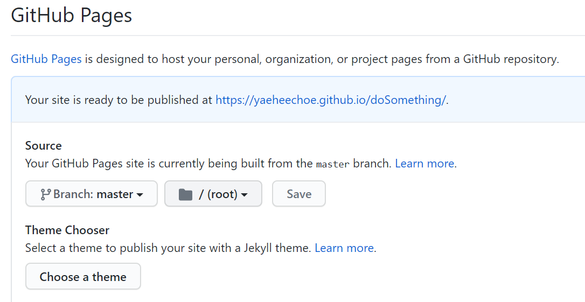

# doSomething
https://choeyehui.github.io/doSomething/index

집에 오래 있으면서 걱정도 많아지는 요즘.
간단한 todo리스트로 오늘 할 일에 집중해보는건 어떨까요?
전 세계 사람들이 찍은 창문 밖을 보며 하루를 시작해보세요.

Tips! 브라우저 홈으로 지정하기
1. 내 저장소에 fork하기

2. fork 된 저장소 > Options>Source> Branch : master, /(root) > Save

   

3. 링크로 가기

4. 해당 링크 브라우저 홈으로 지정

Simple todo list & clock.
Be present, Stay healthy.

